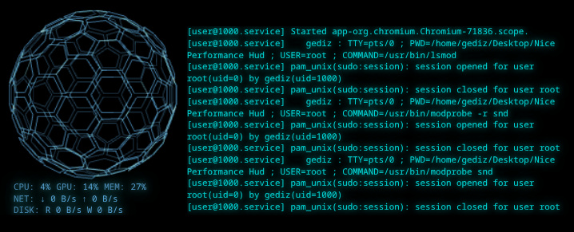

# Performance HUD

A translucent, borderless system performance monitor and real-time log viewer for Linux environments.

## Architecture

*   **Frontend:** HTML5 Canvas, Three.js (WebGL 3D telemetry rendering).
*   **Backend:** Node.js, Electron.
*   **Data Sources:** Direct `/proc` virtual filesystem polling, `systeminformation` module, and asynchronous `journalctl` streaming.

## Installation & Compilation

This application is packaged as a standalone AppImage, requiring no local Node.js runtime for the end-user.

1.  **Clone the repository:**
    ```bash
    git clone <your-repository-url>
    cd performance-hud
    ```

2.  **Install build dependencies:**
    ```bash
    npm install
    ```

3.  **Compile the standalone binary:**
    ```bash
    npm run build
    
**Execution** 
    ```bash
    # Grant execution permissions
    chmod +x dist/performance-hud-1.0.0.AppImage

    # Execute the application
    ./dist/performance-hud-1.0.0.AppImage
    ```
**License**
Distributed under the MIT License. See LICENSE.md for detailed attribution parameters.


###TÜRKÇE (TURKISH)
# Performance HUD

Linux ortamları için yarı saydam, çerçevesiz bir sistem performans izleyicisi ve gerçek zamanlı günlük (log) görüntüleyici.

## Mimari

*   **Önyüz:** HTML5 Canvas, Three.js (WebGL 3D telemetri görselleştirme).
*   **Arkayüz:** Node.js, Electron.
*   **Veri Kaynakları:** Doğrudan `/proc` sanal dosya sistemi sorgulama, `systeminformation` modülü ve asenkron `journalctl` akışı.

## Kurulum ve Derleme

Bu uygulama, son kullanıcı tarafında yerel bir Node.js çalışma zamanı (runtime) gerektirmeyen bağımsız bir AppImage olarak paketlenmiştir.

1.  **Depoyu klonlayın:**
    ```bash
    git clone <depo-adresi>
    cd performance-hud
    ```

2.  **Derleme bağımlılıklarını yükleyin:**
    ```bash
    npm install
    ```

3.  **Bağımsız ikili dosyayı derleyin:**
    ```bash
    npm run build
    
**Çalıştırma** 
    ```bash
    # Grant execution permissions
    chmod +x dist/performance-hud-1.0.0.AppImage

    # Execute the application
    ./dist/performance-hud-1.0.0.AppImage
    ```
**Lisans**
Distributed under the MIT License. See LICENSE.md for detailed attribution parameters.
